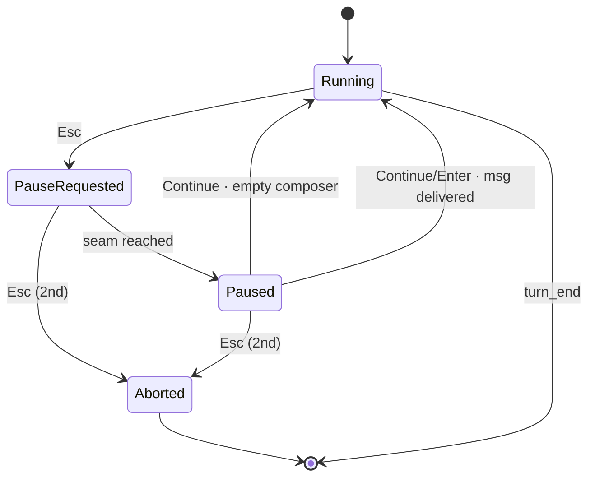

# Pause / Resume / Interject — implementation plan

**Status:** shipped (commits 91bda6b, 0b774aa, 74fe40a, and the Stage 4 commit introducing this status flip).
**Replaces:** UX-1 (hard-stop semantics) and UX-2 (prompt queue / inject at seam).

## TL;DR

A two-stage Esc system. First Esc requests a pause; the agent finishes the
current tool and stops at a clean seam. The user composes an interjection at
leisure, then `Continue` (Enter) delivers it as part of the same turn. A
second Esc aborts. Continue clicked while waiting for the seam **pre-commits**:
when the seam arrives, the message (or empty resume) fires automatically. No
boundary-aware-race; no separate inject-at-seam mechanism; pause is the only
mid-turn intervention primitive.

## Before you start

You are implementing this from a fresh session. Read this document end to end
before writing any code.

Then read `AGENT.md` — especially the sections on Contract Authority
(persistence is the most public contract) and the gate-per-commit testing
discipline (every commit must pass `just gate`, which runs as the pre-commit
hook).

Open and skim the **attention points** below with the referenced files. The
design depends on three subtle places in the existing agent loop; getting
them wrong manifests as either flaky tests or silent conversation-history
corruption.

Work through the four stages in order. Each stage is **one commit** passing
`just gate`. After each commit, stop and report what you did; do not start
the next stage until told to proceed.

## Problem

While the agent is running, the user today has only two options: wait for
`turn_end`, or hit Esc to abort and start a new turn. Aborting is lossy
(in-flight LLM stream is discarded; the log records a `turn_interrupted`
followed by a fresh `user_message`, not a course-correction inside the same
turn). There is no way to nudge the agent mid-turn without abandoning its
progress.

The fix is **pause**: a clean seam where the agent holds, the user composes
without racing, and the conversation continues with the user's text delivered
alongside the last `tool_result`. No in-flight loss; the log shows exactly
what happened.

---

# Design reference

## State machine



Four states. `continuePreCommitted` is a **client-local boolean flag**, not a
distinct state. It is set by clicking Continue while in `PauseRequested`. On
entering `Paused`, if the flag is set, the client immediately fires the
state-appropriate Continue action based on the composer's contents at seam
time — empty composer → plain resume, non-empty → send interjection + resume.
The agent never sees the flag; the seam transition produces a normal `Paused`
state from which the client synthesises the Continue. Dwell time in `Paused`
is zero in the pre-committed case.

The seam is **after all tool_results have been appended to history, before
the next LLM call**. This matches Omega's existing abort-after-tool-execution
guard at `src/agent.ts:1415–1431`. With concurrent tool execution
(`src/agent.ts:1376` `Promise.race`), the seam is reached when **all** tools
have completed.

## Events

Three new `OmegaEvent` variants. All other pause/resume bookkeeping reuses
existing events (`user_message` for the interjection, `turn_interrupted` with
`reason: "aborted"` for abort).

```ts
{ type: "pause_requested", time: ISOTimestamp }
{ type: "turn_paused",     time: ISOTimestamp }
{ type: "turn_continued",  time: ISOTimestamp, mode: "manual" | "auto" }
```

`mode` is a string union, not a boolean — extensible if a third origin (e.g.
`"timeout"`) shows up later.

The interjection itself rides on the wire as a normal user message. The
question of whether it is a separate `user` turn or a text block appended to
the tool_result `user` message is settled below (see attention point 4); from
the event-log perspective, it is a normal `user_message` event bracketed by
`turn_paused` and `turn_continued`.

### Log scenarios

| Scenario | Event sequence |
|---|---|
| Pre-committed Continue, empty composer at seam | `pause_requested` · `turn_paused` · `turn_continued{mode:"auto"}` |
| Pre-committed Continue with text | `pause_requested` · `turn_paused` · `user_message` · `turn_continued{mode:"auto"}` |
| Manual Continue, empty composer | `pause_requested` · `turn_paused` · `turn_continued{mode:"manual"}` |
| Manual Continue with interjection | `pause_requested` · `turn_paused` · `user_message` · `turn_continued{mode:"manual"}` |
| Esc twice (impatient) | `pause_requested` · `turn_interrupted{reason:"aborted"}` |
| Paused, then aborted | `pause_requested` · `turn_paused` · `turn_interrupted{reason:"aborted"}` |

## Button matrix

The `input-row` button slot (currently `Send` / `Abort`,
`src/web/client/App.tsx:1953–1959`) extends to hold a primary button plus an
optional Abort button. Buttons display their keyboard shortcut in their label.

| State | Composer | Buttons visible | Enter fires | Esc fires |
|---|---|---|---|---|
| Idle | empty | `Send ⏎` ghosted | — | — |
| Idle | text | `Send ⏎` | Send | — |
| Running | any | `Pause ⎋` | — | Pause |
| PauseRequested *(no pre-commit)* | any | `Continue ⏎`, `Abort ⎋` | Continue *(sets pre-commit)* | Abort |
| PauseRequested *(pre-committed)* | any | `Take it back`, `Abort ⎋` | — | Abort |
| Paused | empty | `Continue ⏎`, `Abort ⎋` | Continue *(no msg)* | Abort |
| Paused | text | `Continue ⏎`, `Abort ⎋` | Continue *(sends msg)* | Abort |

**Buttons are ground truth.** Keyboard shortcuts are surfaced as visible
labels on buttons. If Enter does nothing in a state, that's because no button
in that state has the Enter shortcut — the user can see this. No hidden
keyboard semantics.

`Take it back` has no keyboard shortcut — mouse-only — to keep it deliberate.

## Status display

The existing status display (`src/web/client/App.tsx:1875–1895`) extends to
surface the turn-state. The current `streaming` boolean is replaced by
`turnState` as the rendering source.

| Turn state | Label | Colour treatment |
|---|---|---|
| Idle | `Ready` | green, static |
| Running | `Streaming…` | yellow, pulsing |
| PauseRequested *(no pre-commit)* | `Pausing…` | yellow, pulsing |
| PauseRequested *(pre-committed)* | `Pausing, will continue` | green, pulsing |
| Paused | `Paused` | green, static |
| Aborting *(transient)* | `Aborting…` | peach, pulsing |

Pre-commit visibly changes the status because it changes what will happen at
the seam — the user must be able to see the difference.

## WS protocol

### Client → server

Three new message types:

```ts
{ type: "pause" }          // user pressed Esc from Running
{ type: "abort" }          // user pressed Esc from PauseRequested or Paused
{ type: "continue", content?: string }
                           // user clicked Continue (manually from Paused,
                           // or synthesised by client on entering Paused
                           // when pre-commit was set). Empty/undefined
                           // content means resume without a message.
```

Notes:

- **No `precommit` message.** Pre-commit is a client-local flag; the wire
  only sees the `continue` message that fires when `Paused` is entered.
- **Continue carries the interjection inline.** This unifies the "send
  interjection + resume" and "resume-only" paths into one server handler.
- **Existing `message` type unchanged.** It still starts a new turn. Pause
  cannot fire from `Idle`.

### Server → client

Extend the existing `session_info` server message with one field:

```ts
{
  type: "session_info",
  // ...existing fields...
  turnState: "idle" | "running" | "pause_requested" | "paused",
}
```

Sent on connect and after every state transition. The client uses this as
the authoritative source for which row of the button matrix to render. On
reconnect, the client recovers the live state without replaying events.

The pre-commit flag is **not** carried in `session_info` — it is purely
client-local UI state. A client that disconnects mid-pre-commit loses it on
reconnect; the user can re-click Continue from the server-reported `paused`
or `pause_requested` state.

## Attention points (existing code)

These are the spots in the existing codebase where the new state machine
intersects subtle behaviour. Read them with the file open before changing
them.

1. **Abort-after-tool-execution guard, `src/agent.ts:1415–1431`.** Today
   this guard runs after `Promise.race` resolves all tool executions. Pause
   shares this exact seam. The new logic checks `pauseRequested` here in
   addition to `signal.aborted`; pause leads to a `turn_paused` emission and
   the loop suspends until resumed.

2. **Interrupted-session guard at sendMessage start, `src/agent.ts:925–961`.**
   When the previous session ended with dangling `tool_use`, this guard
   injects synthetic `tool_result` blocks. Pause does not produce dangling
   tool_use (the seam is *after* tool_result append), so this guard should
   not need changes — but verify by reading it.

3. **Concurrent tool execution, `src/agent.ts:1376`.** `Promise.race`
   resolves tools as they finish; the seam is when **all** tools have
   completed (the `while (pending.length > 0)` loop has drained). Pause
   must wait for all in-flight tools, not just the first to finish.

4. **User-message shape on the wire.** Anthropic's API tolerates two
   consecutive `user` messages. Use the pi-mono convention: the
   interjection is a **separate `user` message** after the tool_result
   `user` message, not appended as a text block to it. Reasons:
   - 1:1 record in `context.jsonl` (cleaner audit, easier to grep).
   - `user_message.contextHash` points to a record containing only the
     interjection, not commingled with tool I/O.
   - pi-mono ships this in production on Anthropic; precedent exists.

5. **Mid-LLM-stream pause.** Pause requested while an LLM stream is in
   flight waits for the stream to **complete normally** (not aborted). The
   assistant message commits to history; the seam lands after the resulting
   tool_results (or directly if no tools). Pause is **never** lossy.
   Compare with abort-during-stream which discards the partial response.

6. **Session resume basis projection, `src/session-resume.ts`.** The
   `projectTurn()` function builds a basis for the resume summarisation
   LLM. Extend it to render interjections inline within the turn, e.g.:

   ```
   User: implement X
   [tool_call: ...]
   [tool_result: ...]
   User (mid-turn): also update the README
   [tool_call: ...]
   ```

   Without this, resumed sessions lose visibility into mid-turn user
   corrections.

## Rejected alternatives

Do not re-open these. They are documented for reference only.

1. **Boundary-aware queueing without explicit pause** (Claude Code,
   opencode queue mode, pi-mono `steer`). Forces the user to race against
   the next seam. Even when fast enough, the user can't *know* whether
   their Enter beat the seam. Pause removes the race entirely.

2. **`InterjectionScheduled` as a fifth state.** Conflates UI commitment
   with agent state. Pre-commit is purely a client flag; the agent's state
   graph doesn't change.

3. **`user_interjection` as a distinct event type.** The pause/resume
   bracket already disambiguates a mid-turn user message from a
   turn-starter, so a normal `user_message` is sufficient. Fewer event
   types.

4. **Boolean `auto` flag on `turn_continued`.** Replaced with
   `mode: "manual" | "auto"`. Booleans ossify; string unions extend.

5. **Direct abort (Esc bypasses pause).** Eliminated. Esc always escalates:
   first press = pause, second press = abort. A user who needs immediate
   kill gets it via two fast Esc presses; the cost (in-flight stream lost
   on the second press from `PauseRequested`) is paid only when explicitly
   chosen.

6. **Auto-pause on first composer keystroke.** Magical; can cause
   unintended pauses. Pause is explicit — Esc, mouse-click, or no pause.

7. **`Send` repurposed as `Queue` while Running.** A future extension, not
   now. Today the `Running` state offers no Enter-bound button; the
   composer is editable but Enter is a no-op.

## Post-turn-queue compatibility (future, low priority)

Post-turn queueing is a separate, future capability. The current design
must not foreclose it. Specifically:

- **The composer must remain enabled while `Running`.** Disabling it
  (currently the case) blocks the future `Queue ⏎` button from existing.
- **`Send` must remain idle-only.** A future `Queue` button will live in
  the `Running` state's primary slot; do not let `Send` fire from `Running`.
- **The event vocabulary must stay distinct.** A future `message_queued` /
  `queue_drained` pair is its own concern; do not bend `turn_continued` to
  cover it.

When post-turn queueing lands, the `Running` row of the button matrix
becomes:

| State | Composer | Buttons visible | Enter | Esc |
|---|---|---|---|---|
| Running | empty | `Pause ⎋` | — | Pause |
| Running | text | **`Queue ⏎`**, `Pause ⎋` | **Queue** | Pause |

Purely additive — no change to pause-state logic.

## Invariants

These must hold after Stage 4. Each is a candidate for an explicit test.

1. **Pause is never lossy.** No partial LLM stream is discarded by pause;
   no tool side-effects are abandoned by pause. (Abort may still be lossy.)
2. **Esc never bypasses pause.** From `Running`, the only effect of Esc is
   to enter `PauseRequested`. The second Esc is required for abort.
3. **Pre-commit is invisible to the agent.** Server-side state and event
   log are identical to a hypothetical user who watched the seam land and
   clicked Continue manually within zero time. The only difference is
   `mode: "auto"` vs `mode: "manual"` on `turn_continued`.
4. **Reconnect preserves pause state.** Closing the browser during `Paused`
   and reopening leaves the agent paused; the UI shows `Paused` and offers
   Continue/Abort. Pre-commit flag does not survive reconnect (acceptable
   v1 trade-off — re-click is one button-press away).
5. **Composer is editable in `Running`, `PauseRequested`, and `Paused`.**
   The user can draft an interjection at any point.
6. **Buttons are ground truth.** No keyboard shortcut exists for an action
   that isn't shown on a visible button.
7. **Concurrent tools.** A pause requested while N tools are running waits
   for **all N** to complete before transitioning to `Paused`.

---

# Implementation

Four stages, four commits. Do not skip ahead. After each commit, stop and
report.

## Stage 1: Agent state machine and events

**Goal:** End-to-end pause capability at the agent level. Events added,
schema extended, `Agent` class takes pause/continue/abort calls. No WS
wiring yet; the server calls these methods directly in Stage 2.

**Files to modify:**

- `src/events.ts` — extend the `OmegaEvent` union.
- The event Zod schema (search for `z.discriminatedUnion` across
  `src/events.ts` and siblings) — add the three new variants.
- `src/agent.ts` — pause state, control methods, seam integration, event
  emission.
- `src/session-resume.ts` — extend `projectTurn()` to render interjections
  inline within a turn.
- Any file with an exhaustive switch on `OmegaEvent.type` — add the three
  new cases (TypeScript compile errors will locate them).
- `src/agent.test.ts` (or the existing Agent test file) — red-green tests
  for each state transition.

**Steps:**

1. Add the three event variants to `OmegaEvent` matching the schema in the
   "Events" section above. `mode` typed as `"manual" | "auto"`, **not**
   `string`.
2. Add Zod validation for the three new types. Round-trip JSON serialise /
   parse them in a unit test.
3. Fix all exhaustive-switch compile errors. Where behaviour is not yet
   relevant (e.g. the client renderer), add a no-op case; Stage 3 fills in
   rendering.
4. On `Agent`, add:
   - `pauseRequested: boolean`
   - `pendingContinue: { content?: string; mode: "manual" | "auto" } | null`
   - `pausedResolver: (() => void) | null` (Promise resolver used to
     suspend the loop while paused)
   - Methods `requestPause()`, `requestContinue(content?: string)`,
     `requestAbort()`.
5. In the agentic loop, after the abort-after-tool-execution guard at
   `src/agent.ts:1415–1431` (tool_results already appended, abort path
   already handled), check `pauseRequested`. If true:
   - Emit `turn_paused`. Clear `pauseRequested`.
   - If `pendingContinue` is already set (pre-commit fired before seam):
     do **not** suspend. Treat as an immediate manual continue with
     `mode: "auto"` — see step 7.
   - Otherwise: `await new Promise<void>(resolve => {
     this.pausedResolver = resolve; })` to suspend.
6. `requestPause()`:
   - Set `pauseRequested = true`.
   - Emit `pause_requested` immediately (does not wait for seam).
7. `requestContinue(content)`:
   - If the loop is currently suspended (`pausedResolver` non-null):
     `mode = "manual"`.
   - Otherwise (still waiting for seam — pre-commit): `mode = "auto"`.
   - Set `pendingContinue = { content, mode }`.
   - If `pausedResolver` is non-null, resolve it.
   - On wake (or immediately after step 5's conditional if pre-commit):
     - If `content` is non-empty, append a new `user` message with a single
       `text` block containing `content` (Option B per attention point 4),
       then emit a `user_message` event.
     - Emit `turn_continued{mode}`. Clear `pendingContinue`.
     - Set `continueLoop = true` so the agentic loop falls through to the
       next API call.
8. `requestAbort()`:
   - Call `.abort()` on the existing `AbortController`.
   - If `pausedResolver` is set, resolve it; the wake branch checks
     `signal.aborted` and exits via `turn_interrupted{reason:"aborted"}`.
9. Update `src/session-resume.ts` `projectTurn()` so `user_message` events
   that occur between `turn_paused` and `turn_continued` render as
   `User (mid-turn): {content}` rather than as turn-starters.

**Tests (red-green):**

Use the `CreateMessageStream` mock pattern (see `AGENT.md`). Required cases:

1. **Pause emits event, suspends loop, manual resume continues.** Mock LLM
   emits a tool_use; tool executes; pause requested; expect `turn_paused`;
   call `requestContinue()` with no content; expect next mock LLM call
   fires; expect `turn_continued{mode:"manual"}`.
2. **Pause + interjection delivers user_message.** Same as (1) but
   `requestContinue("hello")`; expect a `user_message` with `"hello"` and
   a new `user` history record before the next LLM call.
3. **Pre-commit before seam fires auto.** Pause requested while tool is
   mid-run; before tool completes, `requestContinue("x")`; tool
   completes; expect `turn_paused` then `user_message("x")` then
   `turn_continued{mode:"auto"}` without any intervening LLM call delay.
4. **Abort from PauseRequested.** Pause requested mid-tool; abort
   requested before tool completes; expect tool completes (existing
   guard), then `turn_interrupted{reason:"aborted"}`, no `turn_paused`.
5. **Abort from Paused.** Pause requested; tool completes; `turn_paused`
   emitted; abort requested; expect `turn_interrupted{reason:"aborted"}`
   with no further LLM call.
6. **Concurrent tools: pause waits for all.** Mock LLM emits two tool_use
   blocks; pause requested mid-execution; first tool completes, second
   still running; expect **no** `turn_paused` yet; second tool completes;
   **then** `turn_paused`.
7. **No pause: agent runs to completion unchanged.** Sanity: the pause
   code paths must not fire when no pause is requested. Run an existing
   multi-turn test and assert it still passes byte-for-byte in its event
   stream.

**Definition of done:**

- `just gate` passes.
- All seven test cases above present and passing.
- No behaviour change observable from outside the agent when no pause is
  requested.
- Commit message: `agent: add pause/resume/interject state machine`.

## Stage 2: Server wiring and WS protocol

**Goal:** Wire the new WS messages to the Agent's pause API. Track
turn-state server-side and surface it via `session_info` on connect and
after every transition.

**Files to modify:**

- WS protocol types (search: `ClientMessage|ServerMessage` in `src/web/`).
- `src/web/server.ts` — new handlers, turn-state tracking, session_info
  updates.
- `src/web/client/App.tsx` — read and store `turnState` from `session_info`
  (do not yet use it for rendering; that is Stage 3).
- `src/web/server.test.ts` (or wherever) — server-level tests.

**Steps:**

1. Add `pause`, `abort`, `continue` to `ClientMessage`. `continue.content`
   is `string | undefined`.
2. Add `turnState: "idle" | "running" | "pause_requested" | "paused"` to
   the `session_info` `ServerMessage`.
3. Wire handlers:
   - `pause` → `agent.requestPause()`
   - `abort` → `agent.requestAbort()`
   - `continue` → `agent.requestContinue(msg.content)`
4. Track `turnState` server-side, derived from the agent's event stream:
   - `idle` when no turn is active.
   - `running` while streaming, between `turn_start`/`user_message` and
     `pause_requested` / `turn_end` / `turn_interrupted`.
   - `pause_requested` between `pause_requested` and `turn_paused`.
   - `paused` between `turn_paused` and `turn_continued`/`turn_interrupted`.
5. Whenever `turnState` changes, push an updated `session_info` to the
   client.
6. On WS connect, the initial `session_info` carries the live `turnState`.
7. Client: store `turnState` in the global state object. Do not yet render
   from it (Stage 3).
8. Verify attention point 2 — the interrupted-session guard at
   `src/agent.ts:925–961` — still behaves correctly when reconnecting
   during `paused`. Reconnect alone should not trigger it; it only fires
   at the start of a new `sendMessage` call.

**Tests (red-green):**

1. **WS pause → server calls `requestPause`.** Send `{type:"pause"}` over
   the WS; assert `agent.requestPause` was invoked.
2. **Reconnect during `paused` shows correct `turnState`.** Start a turn,
   pause it to seam, drop the WS connection, reconnect; assert the first
   `session_info` after reconnect carries `turnState: "paused"`.
3. **Reconnect during `pause_requested` shows correct `turnState`.** Same
   as (2) but reconnect *before* the seam; assert
   `turnState: "pause_requested"`.
4. **`turnState` transitions emitted.** Pause + manual resume; assert
   client receives `session_info` with `running` → `pause_requested` →
   `paused` → `running` in order.

**Definition of done:**

- `just gate` passes.
- Manual smoke test: pause a real turn, refresh the browser, confirm the
  server-reported `turnState` in the next `session_info` is `paused`.
- Commit message: `server: wire pause/resume WS protocol and turnState`.

## Stage 3: Client UI and keyboard

**Goal:** Render the status display and button matrix from Part 1.
Keyboard shortcuts wired to buttons. Pre-commit flag (client-local) with
drain on entering `paused`. `Take it back` button.

**Files to modify:**

- `src/web/client/App.tsx` — status display, button rendering, keyboard,
  pre-commit.
- `src/web/client/style.css` — colours and animations for new states.
- `e2e/` — new Playwright tests for button visibility and keyboard
  interaction.

**Steps:**

1. Replace the `state.streaming`-derived `statusLabel()` /
   `statusDisplayClass()` (`src/web/client/App.tsx:1875–1895`) with a
   switch on `state.turnState` per the "Status display" table.
2. Add CSS classes `.status-pause-requested`,
   `.status-pause-requested-precommit`, `.status-paused`,
   `.status-aborting` matching the colours in the table.
3. Replace the `Send` / `Abort` button block
   (`src/web/client/App.tsx:1953–1959`) with a render driven by the button
   matrix. Primary button plus optional `Abort` button.
4. Button click handlers fire the right WS messages:
   - `Send` → existing `message` send.
   - `Pause` → `{type:"pause"}`.
   - `Continue` from `PauseRequested` → set local `preCommitted = true`,
     **do not** send WS yet. The `continue` WS message fires when the
     client observes the transition into `paused` (see step 6).
   - `Continue` from `Paused` → `{type:"continue", content?}` where
     `content` is the current composer value or `undefined` if empty.
   - `Take it back` → set local `preCommitted = false`.
   - `Abort` → `{type:"abort"}`.
5. Composer: enabled in `Running`, `PauseRequested`, and `Paused`. The
   existing `disabled={!state.connected}` stays; **do not add**
   `state.streaming` as a disabler. This preserves the future
   post-turn-queue button slot per the compatibility notes.
6. Add a `createEffect` watching `state.turnState`. When it transitions to
   `paused` and `preCommitted` is `true`:
   - Read the composer's current value.
   - Send `{type:"continue", content}` where `content` is the composer
     value if non-empty/non-whitespace, otherwise `undefined`.
   - Clear `preCommitted`; clear the composer only if `content` was sent.
7. Extend `onKeyDown` (`src/web/client/App.tsx:1858` area):
   - `Esc` → fire the Esc-action for the current state per the matrix:
     Pause from `Running`; Abort from `PauseRequested` or `Paused`.
   - `Enter` (no Shift) → fire the Enter-action for the current state per
     the matrix: Send from `Idle` (existing); Continue from
     `PauseRequested` (sets pre-commit) or `Paused` (sends WS).
   - `Enter` while in `Running` is a no-op.
8. On WS reconnect, reset `preCommitted = false` (per design:
   client-local, lost on reconnect).
9. Button labels include the shortcut indicator per the matrix: `Send ⏎`,
   `Pause ⎋`, `Continue ⏎`, `Abort ⎋`, `Take it back` (no shortcut).

**Tests (red-green):**

Playwright e2e, one file e.g. `e2e/pause-ui.spec.ts`:

1. **Status label cycles through states.** Trigger a turn; pause; observe
   `Streaming…` → `Pausing…` → `Paused`; resume; observe → `Streaming…`.
2. **Button matrix per state.** For each row of the button matrix, drive
   the UI into that state and assert the visible buttons match the
   expected set. Include the empty-composer and text-composer sub-rows
   where they differ.
3. **Esc from `Running` → `pause_requested` in feed.**
4. **Esc from `PauseRequested` → `turn_interrupted{reason:"aborted"}`.**
5. **Enter from `Paused` with text → `user_message` +
   `turn_continued{mode:"manual"}` in feed.**
6. **Pre-commit visual change.** From `PauseRequested`, click Continue;
   assert status label is `Pausing, will continue` and primary button is
   `Take it back`.
7. **Pre-commit drain: Continue with text in `PauseRequested` → wait for
   seam → `user_message` + `turn_continued{mode:"auto"}` in feed.**
8. **Take it back: Continue then Take it back → wait for seam → no
   `user_message`; transitions to `Paused` with `turn_continued` only
   after manual Continue.**
9. **Reconnect clears pre-commit.** Continue from `PauseRequested`, reload
   page; assert UI is in `pause_requested` state without pre-commit
   (status label `Pausing…`, primary button `Continue`).

**Definition of done:**

- `just gate` passes.
- All nine e2e tests above pass.
- Manual visual check across all states: idle, running, pause-requested,
  pause-requested-precommit, paused, paused-with-text.
- Commit message: `web: render pause/resume UI and keyboard shortcuts`.

## Stage 4: Cross-cutting e2e and backlog updates

**Goal:** Comprehensive integration tests that exercise pause across the
full agent + server + client + reconnect surface. Update backlog entries
to reflect shipped work.

**Files to modify:**

- `e2e/pause-resume-interject.spec.ts` — new file with the scenarios below.
- `backlog.md` — retire the UX-1 and UX-2 entries; add a one-line pointer
  to this doc as completed.
- `backlog/pause-resume-interject.md` — mark status `shipped` with the
  Stage 1–4 commit hashes.

**Tests:**

1. **Multi-tool turn: pause during second tool.** Mock an LLM turn that
   makes 3 tool calls in series. Click Pause during the second; assert
   `pause_requested` immediately, no `turn_paused` until the second tool
   completes; `turn_paused` then. Resume with interjection; assert the
   third LLM call sees the interjection.
2. **Concurrent tools: pause waits for all.** Mock a turn with two
   parallel tool_use blocks (one fast, one slow). Pause after the fast
   one finishes but before the slow one; assert `turn_paused` fires only
   after the slow tool finishes.
3. **Pause + reconnect + manual continue.** Start a turn, pause to seam,
   close the browser tab, reopen, send interjection, assert it lands as
   the next API call's user message.
4. **Pre-commit + reconnect drops pre-commit.** Start a turn, pause,
   click Continue (pre-commit), close tab before seam, reopen during
   paused state, assert UI shows `Paused` (not auto-continued).
5. **Two pauses in one turn.** A turn that needs many tool calls. Pause,
   interject, resume. Pause again later, interject again, resume. Assert
   both interjections appear in the feed and in the LLM's context on the
   respective subsequent calls.
6. **Pause during LLM stream.** Click Pause while the LLM is emitting a
   response (no tool yet). Assert the assistant message commits in full
   (no truncation) and the seam lands after.
7. **Session resume basis includes interjections.** Run a turn with an
   interjection, close the session, resume it, inspect the basis sent to
   the resumption LLM, assert the interjection appears as
   `User (mid-turn): ...`.

**Definition of done:**

- `just gate` passes.
- All seven scenarios pass on a clean checkout.
- `backlog.md` updated: UX-1 and UX-2 removed; one-line pointer added
  referencing this doc.
- This doc's status line updated to:
  `**Status:** shipped (commits abc1234..def5678).`
- Commit message: `e2e: pause/resume integration tests; retire UX-1/UX-2`.

---

When all four stages are committed and gate-green, the work is done. Report
the four commit hashes and stop.
