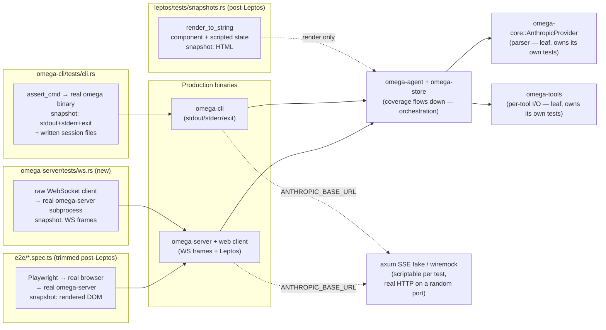

# TEST-ARCH — Test architecture & web-surface honesty

**Owner:** open
**Status:** ✅ All steps complete. TEST-ARCH-1 … 6 done.

Umbrella plan for bringing every test surface in Omega onto a single,
honest pattern: **test through the outermost user-visible surface of each
binary; fake only what we can't run for real (Anthropic); let coverage of
internal modules flow down from the e2e tier**.

When this document was written, the repo had three different patterns
covering three slices of the codebase, an unjustified asymmetry between
CLI and server, and a known mutation-coverage gap on `omega-cli`.
TEST-ARCH-1 through TEST-ARCH-4 closed all of that; the target architecture
below is the current state of the repo. The two remaining steps both
require the Leptos UI rewrite to land first.

---

## Why this happened pre-Leptos (and what's deferred)

The TS web client is frozen pending the Leptos rewrite (Phase 3 of
`rust-migration.md`). Before Leptos landed we wanted three things in place,
all now done:

1. The CLI test pattern established and validated (TEST-ARCH-1). The CLI
   surface won't change with Leptos, so any tests written now survive the
   rewrite.
2. A server-side Rust-level WS-protocol test layer (TEST-ARCH-2), so
   post-Leptos we already have a fast non-browser path for `omega-server`.
3. The `omega-mock-server` ↔ axum-fake decision made and migrated
   (TEST-ARCH-3 + TEST-ARCH-4), so post-Leptos we don't carry parallel
   LLM-fake patterns forward.

What we explicitly *didn't* do before Leptos: invest in tightening Playwright
mutation coverage of `omega-server`. The current TS web UI is going away;
mutation-tightening assertions in tests that disappear is wasted effort. After
Leptos, the bulk of `omega-server` mutation kill rate will come from cheap
Rust HTML-snapshot tests — that's TEST-ARCH-5 and TEST-ARCH-6.

---

## Target architecture

### Principles

1. **Each binary is tested through its outermost user-visible surface.**
   - `omega-cli` → stdout, stderr, exit code, files written under `--session-root`.
   - `omega-server` → WebSocket frames in/out, plus (post-Leptos) rendered HTML.
2. **One LLM mocking boundary, ever.** All fakes plug into
   `omega_core::AnthropicProvider::with_base_url`, either directly or via the
   `ANTHROPIC_BASE_URL` env-var hook in each binary's `main.rs`. No parallel
   `Provider`-trait injection, no `Agent`-level seams, no `RetryingProvider`
   swap-outs. See "LLM mocking: one boundary, two fixture libs" below for
   why two libraries are deliberate.
3. **Coverage of orchestration modules flows down from the e2e tier.** A
   surviving mutant in `omega-agent::send_message` after both e2e suites have
   run is a dead-code signal, not a missing test.
4. **Leaf utilities still own their own unit tests.** Two carve-outs:
   - `omega-core::AnthropicProvider`'s SSE parser — many edge cases (malformed
     deltas, missing fields, truncated streams, retry-after parsing) that you'd
     never reach by scripting an LLM scenario. Deserves dedicated unit tests
     against wiremock or hand-fed byte streams.
   - `omega-tools` per-tool I/O — each tool's input domain (path traversal,
     glob edges, command timeouts, large output truncation) has its own
     surface. Driving every branch via "tell the LLM to call this tool with
     this exact input" is brittle and noisy. Per-tool tests against `tempdir`
     and real subprocesses stay.
5. **Real storage in tests, isolated from production.** Tests use `TempDir` or
   `--session-root` overrides; never write into production `.omega/sessions/`.
   The existing gate session-pollution check enforces this.

---

## LLM mocking: one boundary, two fixture libs

This section records the conclusion of a recurring design discussion so it
doesn't have to happen again.

### Rules

1. **One mocking boundary, ever.** Every fake LLM in this repo plugs into
   `omega_core::AnthropicProvider::with_base_url`, either directly or via
   the `ANTHROPIC_BASE_URL` env-var hook in each binary's `main.rs`. No
   parallel `Provider`-trait injection, no `Agent`-level seams, no
   `RetryingProvider` swap-outs. (TEST-ARCH-3 finished enforcing this.)
2. **Two fixture *implementations* behind that boundary, by deliberate
   choice:**
   - `omega-core/tests/{anthropic,ollama,retry}.rs` use **`wiremock`**.
     Their job is leaf-parser / retry-policy testing: "given this exact
     wire response, does the parser do the right thing?". Declarative
     `(matcher, response)` is the natural shape; `wiremock`'s
     `up_to_n_times` covers the retry-sequencing case cleanly.
   - All binary-level e2e tests (`omega-cli`, `omega-server`,
     `omega-mock-server`) use the **`omega-test-fixtures`** axum SSE
     fake. Their job needs FIFO queue semantics and streaming responses
     with timed deltas (the `LONG_STREAM_TEST` case), which `wiremock`
     cannot do without contortion.
3. **No more than one copy of each fixture.** The axum fake lives in
   `omega-test-fixtures` and is consumed by re-export from each test
   crate's `common/mod.rs`. Forked copies are a regression — fix on sight.

### Why not unify on one library?

Neither library can comfortably take over the other's territory:

- `wiremock` cannot stream timed SSE chunks. Hard requirement for
  `LONG_STREAM_TEST` and any other pause-during-stream scenario.
- The axum fake *can* do everything `wiremock` does, but at ~3× the
  boilerplate per leaf-parser test (~30 tests in `omega-core/tests/` would
  need rewriting). Stylistic uniformity isn't worth the churn.

If this calculus changes (e.g. `wiremock` gains streaming support, or the
leaf-parser tests start needing axum-only features), revisit. Until then:
keep both, document the split, stop discussing it.

---

## Status quo vs. target

| Surface | Status quo | Target |
|---|---|---|
| `omega-types` types | unit tests | unchanged |
| `omega-core::AnthropicProvider` parser | unit tests | unchanged (leaf carve-out) |
| `omega-store` I/O | unit tests | unchanged |
| `omega-tools` per-tool | integration tests with `tempdir` | unchanged (leaf carve-out) |
| `omega-agent` Agent loop | dedicated MockProvider tests in `omega-agent/tests/` | retired — coverage flows down from CLI + server e2e (3 carve-outs in `tests/internal.rs` for compaction / dangling-tool-use / malformed-JSON nudge) |
| `omega-cli` binary | subprocess + HTTP fake via `ANTHROPIC_BASE_URL` | unchanged |
| `omega-server` binary (Rust-side) | subprocess + raw-WS client + same HTTP fake | unchanged |
| `omega-server` binary (browser-side) | Playwright via `omega-mock-server`, hosting an internal SSE fake + real `AnthropicProvider` | trimmed Playwright suite + Leptos HTML snapshots (post-Phase 3) |
| `omega-mock-server` | thin Playwright wrapper: real `omega-server` + internal SSE fake on `127.0.0.1:0` + control HTTP API on `:3004` | unchanged |
| LLM HTTP fake implementation | single `omega-test-fixtures` workspace dev-helper crate | unchanged |

---

## Steps, in order

### TEST-ARCH-1 — `omega-cli` e2e via subprocess + HTTP fake (BUG-C)

**Status:** ✅ **Done.** 17 caught, 0 missed.

`ANTHROPIC_BASE_URL` + `OMEGA_RETRY_INITIAL_MS` env hooks; axum SSE fake on a
random port; six tests in `omega-cli/tests/cli.rs` (`--help`, missing key,
happy turn, tool-use round trip, retry exhaustion, stderr snapshot).
Dev-deps: `assert_cmd`, `insta`, `tempfile`, `axum`.

---

### TEST-ARCH-2 — `omega-server` Rust-level WS-protocol tests

**Status:** ✅ **Done.** 67 caught, 1 missed (documented equivalent:
`Message::Close` arm — deletion falls through to identical behaviour via
the next `reader.next()` returning `None`).

`ANTHROPIC_BASE_URL` hook in `omega-server/src/main.rs`; 16 in-process WS
tests + one subprocess e2e test; insta snapshots for key frames with
`time`/`dir`/`cwd` redacted. Two production bugs fixed: **BUG-S1** (ABBA
deadlock in `send_session_info_and_history`); **BUG-S2**
(`session_info.turnState` stayed `"idle"` during resumption).

---

### TEST-ARCH-3 — Retire / repurpose `omega-mock-server`

**Status:** ✅ **Done.** Outcome: option B (repurpose as a thin Playwright
wrapper around the HTTP fake), plus the workspace-wide axum-fake
de-duplication that was the second half of this task.

What shipped:

- `omega-mock-server` no longer injects a `Provider` trait. It hosts the
  production [`omega_server::serve`] driven by a real
  [`omega_core::AnthropicProvider`] whose base URL points at an internal
  Anthropic-shaped SSE fake on a random `127.0.0.1` port. The full HTTP/SSE
  code path (request serialisation, `reqwest`, SSE parser) now runs under
  every Playwright test.
- The Playwright control surface keeps its 3004 port: `POST /control/script`
  loads a per-test queue of `MockResponse`s, `GET /control/llm-calls`
  returns captured requests, `POST /control/reset-calls` clears the
  history. TS-side helper at `e2e/fixtures/real-server-control.ts`.
- New workspace dev-helper crate **`omega-test-fixtures`** — single
  source of the LLM HTTP fake. The previously forked copies in
  `omega-cli/tests/common/`, `omega-server/tests/common/`, and
  `omega-mock-server/src/fake.rs` (847 lines combined) collapsed into one
  ~530-line crate consumed by all three call-sites.

**Success criterion (met):**
`grep -r "MockProvider" rust/crates/omega-mock-server/` returns no results;
all 116 Playwright browser tests (`just test-browser`) pass; `just rust-gate`
passes.

---

### TEST-ARCH-4 — Retire `omega-agent/tests/` MockProvider suite

**Status:** ✅ **Done.** 132 mutants tested in 25m: 49 caught, 83 unviable, 0 missed.

The Phase 1d.0a MockProvider suite (14 test files, ~3500 lines) is
retired. The agent loop is now exercised end-to-end by
`omega-cli/tests/cli.rs` (TEST-ARCH-1) and
`omega-server/tests/{ws,ws_router}.rs` (TEST-ARCH-2). Three carve-outs
remain in `omega-agent/tests/internal.rs` for genuinely agent-internal
behaviour that would require extending `omega-test-fixtures` with
undocumented or low-value SSE shapes:

1. **Dangling tool_use repair** — synthesising `is_error` `tool_result`
   blocks when history ends on an unmatched `tool_use`. Reproducing
   through the HTTP fake would require crashing mid-turn and resuming
   from disk.
2. **Server-side compaction** — agent reaction to
   `OmegaEvent::Compacted`. The trigger is Anthropic's undocumented
   compaction marker, which the SSE fake doesn't emit.
3. **Malformed-tool-use JSON nudge** — corrective re-issue when the SSE
   parser surfaces a `LlmError::Stream { "malformed tool_use JSON: …" }`.
   In-process error injection is far more direct than crafting an SSE
   byte stream the parser rejects in exactly that shape.

Five inline `#[cfg(test)]` tests for `elide_request` (singular/plural
labels, empty-tools omission) were added directly to `agent.rs` to kill
the pure-function pluralisation mutants that no downstream test
observes (`LlmCall.request_summary` isn't snapshotted in WS frames).

Three `#[mutants::skip]` annotations cover surviving mutants that are
load-bearing in production but invisible to mutation testing:
`ControlHandle::pending_continue_ready`,
`ControlHandle::exit_suspend`, and `controls::now_iso` (timestamps are
redacted in every WS / CLI snapshot).

**Success criterion (met):** `omega-agent/tests/` contains only
`internal.rs` + `common/mod.rs`; `cargo mutants -p omega-agent
--test-workspace true` reports 0 missed; `just rust-gate` and
`just test-browser` both pass.

---

### TEST-ARCH-5 — Leptos HTML snapshot tests

**Status:** ✅ **Done** (Phase 3.6, commit `cfd8ce9`).

`leptos::ssr::render_to_string` + `insta` HTML-snapshot harness added in
`frontends/leptos/tests/snapshots.rs`. 27 snapshot tests cover every
major component variant. The gate runs them via `cargo test --test
snapshots --no-default-features --features ssr`.

---

### TEST-ARCH-6 — Drive full workspace to zero-missed

**Status:** ✅ **Done** (Phase 4 Step 5, commit `25cb34a`).

Post-harness mutation re-baseline with omega-e2e excluded:
`rust/` workspace 688 mutants, **0 missed**; `frontends/leptos/` 206 mutants,
**0 missed**. The `omega-server` crate is fully covered within the workspace
sweep.

---

## Cross-references

- `rust-migration.md` — BUG-C was the same work as TEST-ARCH-1; the Phase-3
  Leptos rewrite gates TEST-ARCH-5 and TEST-ARCH-6.
- `rust/PHASE-1d.0-NOTES.md` — Phase 1d.0a's MockProvider tests were the
  suite retired in TEST-ARCH-4.
- `nutriterm/tests/cli.rs`, `nutriterm/tests/common.rs` — reference pattern
  for TEST-ARCH-1's `assert_cmd` + `insta` + path-normalisation shape.
