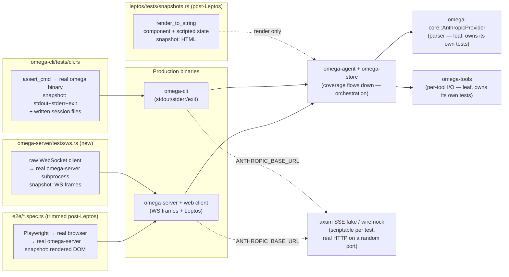

# TEST-ARCH — Test architecture & web-surface honesty

**Owner:** open
**Status:** 🔴 Top priority
**Pre-Leptos work; some sub-items deferred until after Phase 3.**

This is the umbrella plan for bringing every test surface in Omega onto a
single, honest pattern: **test through the outermost user-visible surface of
each binary; fake only what we can't run for real (Anthropic); let coverage of
internal modules flow down from the e2e tier**.

The current state has three different patterns covering three slices of the
codebase, an unjustified asymmetry between CLI and server, and a known
mutation-coverage gap on `omega-cli`. This document defines the target and the
ordered steps to get there.

---

## Why now (and why not later)

The TS web client is frozen pending the Leptos rewrite (Phase 3 of
`rust-migration.md`). Before Leptos lands we want:

1. The CLI test pattern established and validated. The CLI surface won't
   change with Leptos, so any tests written now survive the rewrite.
2. A server-side Rust-level WS-protocol test layer in place, so post-Leptos
   we already have a fast non-browser path for `omega-server`.
3. The `omega-mock-server` ↔ `wiremock-style HTTP fake` decision made and
   migrated, so post-Leptos we don't carry two LLM-fake patterns forward.

What we explicitly *don't* do before Leptos: invest in tightening Playwright
mutation coverage of `omega-server`. The current TS web UI is going away;
mutation-tightening assertions in tests that disappear is wasted effort. After
Leptos, the bulk of `omega-server` mutation kill rate will come from cheap
Rust HTML-snapshot tests, and the work is justified.

---

## Target architecture

### Principles

1. **Each binary is tested through its outermost user-visible surface.**
   - `omega-cli` → stdout, stderr, exit code, files written under `--session-root`.
   - `omega-server` → WebSocket frames in/out, plus (post-Leptos) rendered HTML.
2. **One fake LLM, plugged in at the HTTP boundary.** An Anthropic-shaped axum
   server serving scriptable `/v1/messages` SSE, addressed via the
   `ANTHROPIC_BASE_URL` env var (already supported by
   `AnthropicProvider::with_base_url`; the env-var hook is one line per
   binary). Both CLI and server tests use the same fake.
3. **Coverage of orchestration modules flows down from the e2e tier.** A
   surviving mutant in `omega-agent::send_message` after both e2e suites have
   run is a dead-code signal, not a missing test.
4. **Leaf utilities still own their own unit tests.** Two carve-outs:
   - `omega-core::AnthropicProvider`'s SSE parser — many edge cases (malformed
     deltas, missing fields, truncated streams, retry-after parsing) that you'd
     never reach by scripting an LLM scenario. Deserves dedicated unit tests
     against wiremock or hand-fed byte streams.
   - `omega-tools` per-tool I/O — each tool's input domain (path traversal,
     glob edges, command timeouts, large output truncation) has its own
     surface. Driving every branch via "tell the LLM to call this tool with
     this exact input" is brittle and noisy. Per-tool tests against `tempdir`
     and real subprocesses stay.
5. **Real storage in tests, isolated from production.** Tests use `TempDir` or
   `--session-root` overrides; never write into production `.omega/sessions/`.
   The existing gate session-pollution check enforces this.

---

## Status quo vs. target

| Surface | Status quo | Target |
|---|---|---|
| `omega-protocol` types | unit tests | unchanged |
| `omega-core::AnthropicProvider` parser | unit tests | unchanged (leaf carve-out) |
| `omega-store` I/O | unit tests | unchanged |
| `omega-tools` per-tool | integration tests with `tempdir` | unchanged (leaf carve-out) |
| `omega-agent` Agent loop | dedicated MockProvider tests in `omega-agent/tests/` | retired — coverage flows down from CLI + server e2e |
| `omega-cli` binary | **no tests** (BUG-C) | subprocess + HTTP fake via `ANTHROPIC_BASE_URL` |
| `omega-server` binary (Rust-side) | none | subprocess + raw-WS client + same HTTP fake |
| `omega-server` binary (browser-side) | full Playwright suite via `omega-mock-server` (Provider-trait injection) | trimmed Playwright suite + Leptos HTML snapshots; Provider-trait injection retired |
| `omega-mock-server` | binary fixture for Playwright | retired or repurposed as a thin wrapper around the HTTP fake |

---

## Steps, in order

### TEST-ARCH-1 — `omega-cli` e2e via subprocess + HTTP fake (BUG-C)

**Status:** ✅ **Done.** `just rust-mutants-cli` reports 17 caught, 0 missed.

Landed:

- `ANTHROPIC_BASE_URL` and `OMEGA_RETRY_INITIAL_MS` env-var hooks in
  `omega-cli/src/main.rs`.
- `omega-cli/tests/common/mod.rs` — axum SSE fake with `MockResponse::{Text,
  ToolUse, HttpError}` on a 127.0.0.1 random port; task aborted on drop.
- `omega-cli/tests/cli.rs` — six tests covering `--help`, missing API key,
  happy text turn, tool-use round trip, retry exhaustion, and a
  belt-and-braces stderr snapshot.
- Dev-deps: `assert_cmd`, `insta`, `tempfile`, `axum`, `serde_json`.

The retry-exhaustion test asserts on the `waitMs` field of persisted
`llm_retry` events, which is what makes the `initial_backoff` field mutant
observable from outside the binary. The `now_iso` mutants are killed by
reading `events.jsonl` and checking the `session_started.time` field looks
like an ISO-8601 timestamp.

Cross-reference: BUG-C section in `rust-migration.md`.

---

### TEST-ARCH-2 — `omega-server` Rust-level WS-protocol tests

**Status:** ✅ **Done.** Mutation run on `crates/omega-server/src/router.rs`
reports 1 missed, 67 caught — the missed mutant is the documented
equivalent (`Message::Close(_)` arm in `handle_socket`, where deletion
falls through to identical behaviour via the next `reader.next()` returning
`None`).

Landed:

- `ANTHROPIC_BASE_URL` env-var hook in `omega-server/src/main.rs` (mirrors
  the omega-cli hook).
- `omega-server/tests/common/mod.rs` — the same axum SSE fake as omega-cli,
  duplicated for now (TEST-ARCH-3 will consolidate or retire one copy).
- `omega-server/tests/ws_router.rs` — 16 tests using `tokio-tungstenite` raw
  WS client + `MockProvider` for in-process WS-routing coverage; one
  subprocess test (`e2e_full_turn_via_http_fake`) validates the
  `ANTHROPIC_BASE_URL` hook end-to-end.
- Insta snapshots for `model_changed`, `effort_changed`, `session_deleted`,
  and the post-`turn_end` `session_info(turnState="idle")` frames, with
  `time` / `dir` / `cwd` redacted.
- Dev-deps added: `insta`, `axum`, `assert_cmd`.

Two production bugs surfaced and were fixed as part of this work:

- **BUG-S1**: ABBA deadlock in `send_session_info_and_history` (held
  `active_session` across `info_cache`/`turn_state` await; streaming task
  held `turn_state` and needed `active_session`). Fixed by extracting Arc
  handles before releasing `active_session`.
- **BUG-S2**: `session_info.turnState` stayed `"idle"` during session
  resumption because `perform_resumption` never yields
  state-changing events. Fixed by bracketing the resumption stream with
  explicit `"running"` / `"idle"` transitions in `handle_resume_session`,
  and removing the now-dead `PauseRequested` arm from `next_turn_state_for`.

**Out of scope (deferred):** retiring `omega-mock-server` (TEST-ARCH-3) and
the `omega-agent/tests/` MockProvider suite (TEST-ARCH-4).

---

### TEST-ARCH-3 — Retire / repurpose `omega-mock-server`

**Status:** ⬜ blocked on TEST-ARCH-2.

Once TEST-ARCH-2 lands, `omega-server` is exercisable via the HTTP fake at the
real-Anthropic boundary. The Provider-trait-injected mock binary
(`omega-mock-server`) is then a parallel pattern doing the same job less
faithfully (skips AnthropicProvider HTTP/SSE code path).

Two options:

A. **Retire** `omega-mock-server` outright. Migrate the Playwright suite to
   use the production `omega-server` binary with `ANTHROPIC_BASE_URL` set.
B. **Repurpose** `omega-mock-server` as a thin Playwright-only wrapper that
   hosts the HTTP fake on the side, so Playwright still talks to a single
   convenient subprocess.

Decide at the time based on Playwright-fixture ergonomics. Either way, the
underlying LLM fake becomes one implementation across the whole codebase.

---

### TEST-ARCH-4 — Retire `omega-agent/tests/` MockProvider suite

**Status:** ⬜ blocked on TEST-ARCH-1 + TEST-ARCH-2 landing.

The six existing `omega-agent/tests/*.rs` files date from Phase 1d.0a, when
the agent loop had no downstream e2e coverage. Once TEST-ARCH-1 and
TEST-ARCH-2 are in place, those scenarios are covered transitively by CLI
and/or server e2e tests, and the in-crate suite becomes:

- Double-counted coverage (mutants killed twice).
- A coupling layer between tests and `omega-agent`'s internal types
  (Agent struct, send_message signature, AgentItem).
- A reason mutation runs scoped per-crate look healthier than the system
  actually is.

Retire after verifying the equivalent scenarios are present in TEST-ARCH-1 /
TEST-ARCH-2.

**Success criterion:** `omega-agent/tests/` is empty (or contains only
genuinely agent-internal pure-function tests, e.g. dangling-tool-use repair
that's awkward to provoke through a real LLM script). Mutation run on
`omega-agent` either passes via downstream coverage, or surviving mutants are
explicitly accepted as dead code.

---

### TEST-ARCH-5 — Leptos HTML snapshot tests *(post-Phase 3)*

**Status:** ⬜ blocked on Leptos rewrite landing.

When the Leptos UI ships, add a fast Rust test layer:

- For each component, construct a reactive state via the same event-sequence
  scripts the WS protocol tests use.
- Render via `leptos::ssr::render_to_string` (or component-level testing
  utilities).
- Snapshot the HTML with `insta`.

This is the cheap bulk of post-Leptos UI testing. Expected to replace ~80% of
the current Playwright surface area. Keep Playwright for genuinely
browser-only concerns: keyboard navigation, focus, scroll behaviour,
reconnection UX, mobile layout, hydration mismatches.

---

### TEST-ARCH-6 — Drive `rust-mutants-server` to zero-missed *(post-Phase 3)*

**Status:** ⬜ blocked on TEST-ARCH-5.

With the bulk of UI coverage now in fast Rust tests (TEST-ARCH-5), running
mutation testing on `omega-server` is finally cheap. Drive it to the same
zero-missed bar as `omega-tools` and (per TEST-ARCH-1) `omega-cli`.

---

## Cross-references

- `rust-migration.md` — BUG-C is the same work as TEST-ARCH-1; the Phase-3
  Leptos rewrite gates TEST-ARCH-5 and TEST-ARCH-6.
- `rust/PHASE-1d.0-NOTES.md` — Phase 1d.0a's MockProvider tests are the
  suite slated for retirement in TEST-ARCH-4.
- `nutriterm/tests/cli.rs`, `nutriterm/tests/common.rs` — reference pattern
  for TEST-ARCH-1's `assert_cmd` + `insta` + path-normalisation shape.
