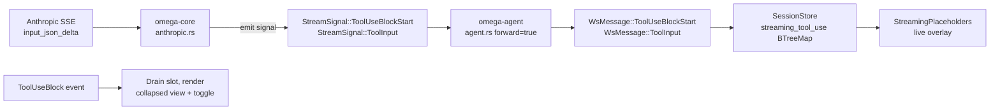

# Tool-input streaming — end-to-end forwarding of `input_json_delta`

**Status:** complete (steps 1–10 shipped; one e2e browser test deferred — see below).

## Why

Anthropic streams tool-use blocks at the API level via `input_json_delta`
SSE events that carry the JSON input character by character. Omega
accumulates these fragments server-side and emits a single
`StreamSignal::ToolUseBlockComplete` once the block closes, **without
forwarding any of the intermediate deltas to the UI**.

The visible consequence: while a long tool dispatch is being composed by
the model — a multi-line `bash` script, a 50-edit `edit_file`
`replacements` array — the operator sees nothing. The block appears
fully-formed only at `content_block_stop`, often after several seconds
of latency that look like a stall.

Two related papercuts on the settled view, addressed by the same change:

- The settled `ToolUseBlock` opens a `TextModal` (a global overlay) on
  click as the only way to inspect the full input. The full body is
  available, but accessing it requires interrupting flow with a modal.
- The "more / less" affordance that thinking blocks have is absent;
  drilling into a tool-use payload uses a different mechanism from
  drilling into a thinking block.

After this change, tool-use blocks behave like thinking blocks:

| Phase    | Before                                      | After                                       |
| -------- | ------------------------------------------- | ------------------------------------------- |
| Streaming | Nothing shown                                | Live overlay: tool name + growing partial JSON |
| Settled   | Inline preview + click-to-open modal         | Inline preview + unconditional more/less toggle that expands the full JSON in place |
| Modal     | `TextModal` opens with the full input        | Removed for tool-use blocks                  |

The collapsed end-state preserves what the current UI shows: tool label
plus per-tool specialised argument preview from `tool_call_preview`.
Only the drill-down mechanism changes (inline toggle, not modal) and a
new streaming phase appears.

## Design

### Two new wire signals

Mirroring the text/thinking pattern:

```rust
// omega-types/src/stream_signal.rs
ToolUseBlockStart { index: usize, id: String, name: String }
ToolInput         { index: usize, partial_json: String }
```

`ToolUseBlockStart` opens the slot, carrying `id` and `name` so the UI
can render the label before any deltas arrive. `ToolInput` appends a
JSON fragment.

**Alternatives considered:**

- *One signal carrying `id`/`name` on every delta*. Rejected — wire
  bloat for redundant fields. The start/delta split matches how
  Anthropic itself frames it (`content_block_start` vs `content_block_delta`).
- *Emit a `partial: true` `ToolUseBlockEvent` at start*. Rejected —
  these events are persisted to `events.jsonl`; a synthetic "start"
  event would pollute history.

### Client treats `partial_json` as opaque

Mid-stream `partial_json` is not valid JSON. The streaming overlay
displays it raw inside a `<pre>` (same as thinking). Only the final
`ToolUseBlock` event carries parsed JSON, so the per-tool specialised
preview (`tool_call_preview`) is available only after settlement — which
matches the thinking-block model exactly.

### Streaming-buffer drain rules

A new `streaming_tool_use: BTreeMap<usize, StreamingToolUseSlot>` in
`SessionStore` parallels `streaming_text` / `streaming_thinking`.
Drain points match the existing buffers:

- `OmegaEvent::ToolUseBlock` → `pop_first()` (blocks complete in start
  order on the Anthropic wire — same invariant the text/thinking
  buffers already rely on).
- `LlmResponseEnded` / `LlmResponseDiscarded` → clear all stragglers.
- `UserMessage` / `TurnEnd` / `TurnInterrupted` / `LlmResponseStarted`
  / `ResetDone` / `History` → clear (turn-boundary or session-reset).

### UI: unconditional toggle, not conditional

The existing thinking toggle only renders when content exceeds 3 lines
(`needs_toggle`). For tool-use the toggle button is **always**
rendered — explicit request, and "no toggle visible" would be
confusing when the body is only the preview line.

### Modal removal is local

The `TextModalState` context and the `TextModal` component remain.
They're still used by `LlmResponseEnded[payload]`, `ToolCall[payload]`,
`ToolResult[payload]`, and the thinking/payload buttons on
`llm_call`/`llm_response`. Only the `OmegaEvent::ToolUseBlock` arm's
`on:click=text_modal.open(...)` and its associated `modal_title` /
`full_input` bindings were removed.

## Architecture



## Implementation log

### Step 1 — `omega-types`: new `StreamSignal` variants ✅

`ToolUseBlockStart { index, id, name }` and `ToolInput { index, partial_json }`
added to `stream_signal.rs`. Round-trip serde tests added.

### Step 2 — `omega-core::anthropic`: emit the new signals ✅

- `content_block_start` / `tool_use` branch yields `ToolUseBlockStart`.
- `InputJsonDelta` / `ToolUse` arm yields `ToolInput` before pushing to
  `pj`. Server-side accumulation unchanged.

Unit test in `omega-core/tests/anthropic.rs` asserts the full
SSE → signal sequence for a tool-use block.

### Step 3 — `omega-agent`: forward the new signals ✅

Both variants forwarded (`forward = true`) in both streaming loops
(regular path and resume path). Helper docstring updated.

### Step 4 — `omega-server`: nothing (verified transparent) ✅

`WsMessage::Item(Box<AgentItem>)` is `#[serde(untagged)]`; new variants
forwarded verbatim.

### Step 5 — Leptos `protocol.rs`: add `WsMessage` variants ✅

`ToolUseBlockStart` and `ToolInput` added. Both return `None` from
`into_omega_event`. Module-level docstring updated (3 → 5 stream-signal
tags).

### Step 6 — `SessionStore`: new streaming buffer ✅

`StreamingToolUseSlot { id, name, partial_json }` and
`streaming_tool_use: RwSignal<BTreeMap<usize, StreamingToolUseSlot>>`
added. Reducer rules, drain logic, snapshot, and unit tests all
parallel the text/thinking buffers.

### Step 7 — `StreamingPlaceholders`: live overlay ✅

Third `<For>` block added to `StreamingPlaceholders`. Auto-scroll
Effect subscribes to `streaming_tool_use`.

### Step 8 — Settled `ToolUseBlock`: inline toggle, no modal ✅

`ToolUseBlock` arm rewritten following `ThinkingBlock` as template.
Local `RwSignal<bool> expanded`; unconditional more/less button
(`thinking-toggle-btn` CSS class); body `<pre>` gated on `expanded`.
`text_modal` lookup, `modal_title`, and `full_input` bindings removed
from this arm only.

### Step 9 — Comment & docstring cleanup ✅

All four listed sites updated inline as each step was implemented.

### Step 10 — Tests ✅ (with one deferred item)

| Sub-test | Location | Status |
|----------|----------|--------|
| `ws_router` integration: `ToolUseBlockStart` + 2× `ToolInput` + `ToolUseBlock` arrive in order | `omega-server/tests/ws_router.rs::tool_input_streaming_frames_arrive_in_order` | ✅ |
| Empty-input case: `ToolUseBlockStart` + no `ToolInput` + `ToolUseBlock` drains cleanly | `ws_router.rs::tool_input_streaming_empty_input_drains_cleanly` | ✅ |
| wasm-bindgen toggle: starts collapsed; flips on update; unconditional for short input | `feed.rs::{tool_use_toggle_starts_collapsed, _flips_on_update, _unconditional_for_short_input}` | ✅ |
| e2e browser: overlay renders live partial JSON; drains and shows toggle on settlement | `06_feed.rs` — **not yet written** | ⏳ deferred |

The deferred browser test requires mounting a live Leptos component and
injecting WS messages to observe the overlay appearing and resolving.
There is no existing wasm-component-rendering harness in the project;
the natural home is a new `async fn streaming_tool_use_overlay_appears_and_resolves`
in `06_feed.rs`, parallel to the existing
`streaming_overlay_appears_live_and_resolves`.

### Collateral fixes (same commits)

- **`07_scroll` flakiness fixed** (`scroll_tailing`,
  `tailing_survives_rapid_streaming_after_button_click`): Guard 1 in
  `on_scroll` was suppressing the test's `el.scrollTop = 0` when it
  landed inside the ~16 ms `scroll_pending` rAF window. Fixed by only
  suppressing events with `scroll_top >= AUTOSCROLL_THRESHOLD_PX`
  (40 px); content-mutation side effects are always near the bottom,
  never at 0.

- **`08_modal_esc::text_modal_esc_closes` updated**: the test was
  clicking the `ToolUseBlock` row to open `TextModal`. Step 8 removed
  that `on:click` handler. Updated to click the always-rendered
  `leptos-tool-result-payload-btn` button on the `tool_result` block.

## Files touched

| File | Change |
|------|--------|
| `rust/crates/omega-types/src/stream_signal.rs` | +2 enum variants, +tests |
| `rust/crates/omega-core/src/anthropic.rs` | yield 2 new signals |
| `rust/crates/omega-core/tests/anthropic.rs` | +1 SSE→signal sequence test |
| `rust/crates/omega-agent/src/agent.rs` | +2 forwarding arms × 2 loops; comment fix |
| `rust/crates/omega-server/tests/ws_router.rs` | +2 integration tests |
| `frontends/leptos/src/protocol.rs` | +2 `WsMessage` variants; docstring |
| `frontends/leptos/src/store.rs` | +`streaming_tool_use`, reducer rules, snapshot, tests |
| `frontends/leptos/src/feed.rs` | +overlay; rewrite `ToolUseBlock` arm; scroll guard fix; toggle tests |
| `rust/crates/omega-e2e/tests/06_feed.rs` | *(pending: overlay e2e test)* |
| `rust/crates/omega-e2e/tests/07_scroll.rs` | scroll guard fix is in `feed.rs`; test unchanged |
| `rust/crates/omega-e2e/tests/08_modal_esc.rs` | updated click target for `text_modal_esc_closes` |

## Risks (resolved)

1. **Index reuse on interleaved-thinking responses.** `ToolUseBlockStart`
   for an in-use slot overwrites `id`/`name`. Reducer is explicit.

2. **`pop_first` on settle.** Mirrors the existing text/thinking
   pattern; same fix would apply to all three buffers if wrong.

3. **Empty-input tool calls.** Covered by
   `tool_input_streaming_empty_input_drains_cleanly`.

4. **Wire-protocol versioning.** Within the monorepo both sides ship
   together; no external clients affected.
