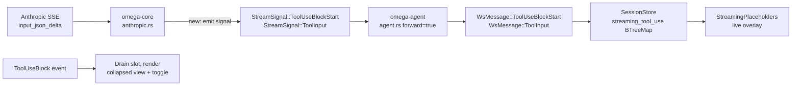

# Tool-input streaming — end-to-end forwarding of `input_json_delta`

**Status:** open. No backward-compatibility constraints; the new wire
tags are additive and old clients ignore unknown `type` discriminants
gracefully (verify during step 4).

## Why

Anthropic streams tool-use blocks at the API level via `input_json_delta`
SSE events that carry the JSON input character by character. Omega
accumulates these fragments server-side and emits a single
`StreamSignal::ToolUseBlockComplete` once the block closes, **without
forwarding any of the intermediate deltas to the UI**.

The visible consequence: while a long tool dispatch is being composed by
the model — a multi-line `bash` script, a 50-edit `edit_file`
`replacements` array — the operator sees nothing. The block appears
fully-formed only at `content_block_stop`, often after several seconds
of latency that look like a stall.

Two related papercuts on the settled view, addressed by the same change:

- The settled `ToolUseBlock` opens a `TextModal` (a global overlay) on
  click as the only way to inspect the full input. The full body is
  available, but accessing it requires interrupting flow with a modal.
- The "more / less" affordance that thinking blocks have is absent;
  drilling into a tool-use payload uses a different mechanism from
  drilling into a thinking block.

After this change, tool-use blocks behave like thinking blocks:

| Phase    | Today                                       | After                                       |
| -------- | ------------------------------------------- | ------------------------------------------- |
| Streaming | Nothing shown                                | Live overlay: tool name + growing partial JSON |
| Settled   | Inline preview + click-to-open modal         | Inline preview + unconditional more/less toggle that expands the full JSON in place |
| Modal     | `TextModal` opens with the full input        | Removed for tool-use blocks                  |

The collapsed end-state preserves what the current UI shows: tool label
plus per-tool specialized argument preview from `tool_call_preview`.
Only the drill-down mechanism changes (inline toggle, not modal) and a
new streaming phase appears.

## Design

### Two new wire signals

Mirroring the text/thinking pattern:

```rust
// omega-types/src/stream_signal.rs
ToolUseBlockStart { index: usize, id: String, name: String }
ToolInput         { index: usize, partial_json: String }
```

`ToolUseBlockStart` opens the slot, carrying `id` and `name` so the UI
can render the label before any deltas arrive. `ToolInput` appends a
JSON fragment.

**Alternatives considered:**

- *One signal carrying `id`/`name` on every delta*. Rejected — wire
  bloat for redundant fields. The start/delta split matches how
  Anthropic itself frames it (`content_block_start` vs `content_block_delta`).
- *Emit a `partial: true` `ToolUseBlockEvent` at start*. Rejected —
  these events are persisted to `events.jsonl`; a synthetic "start"
  event would pollute history.

### Client treats `partial_json` as opaque

Mid-stream `partial_json` is not valid JSON. The streaming overlay
displays it raw inside a `<pre>` (same as thinking). Only the final
`ToolUseBlock` event carries parsed JSON, so the per-tool specialized
preview (`tool_call_preview`) is available only after settlement — which
matches the thinking-block model exactly.

### Streaming-buffer drain rules

A new `streaming_tool_use: BTreeMap<usize, StreamingToolUseSlot>` in
`SessionStore` parallels `streaming_text` / `streaming_thinking`.
Drain points match the existing buffers:

- `OmegaEvent::ToolUseBlock` → `pop_first()` (blocks complete in start
  order on the Anthropic wire — same invariant the text/thinking
  buffers already rely on).
- `LlmResponseEnded` / `LlmResponseDiscarded` → clear all stragglers.
- `UserMessage` / `TurnEnd` / `TurnInterrupted` / `LlmResponseStarted`
  / `ResetDone` / `History` → clear (turn-boundary or
  session-reset).

### UI: unconditional toggle, not conditional

The existing thinking toggle only renders when content exceeds 3 lines
(`needs_toggle`). For tool-use the toggle button is **always**
rendered — explicit request, and "no toggle visible" would be
confusing when the body is only the preview line.

### Modal removal is local

The `TextModalState` context and the `TextModal` component remain.
They're still used by `LlmResponseEnded[payload]`, `ToolCall[payload]`,
`ToolResult[payload]`, and the thinking/payload buttons on
`llm_call`/`llm_response`. Only the `OmegaEvent::ToolUseBlock` arm's
`on:click=text_modal.open(...)` and its associated `modal_title` /
`full_input` bindings go.

## Architecture



## Workstream

### Step 1 — `omega-types`: new `StreamSignal` variants

**File:** `rust/crates/omega-types/src/stream_signal.rs`

Add the two variants above. Add round-trip tests mirroring
`text_signal_round_trips`.

### Step 2 — `omega-core::anthropic`: emit the new signals

**File:** `rust/crates/omega-core/src/anthropic.rs`

- In `"content_block_start"` arm, when `content_block` is `tool_use`:
  yield `StreamSignal::ToolUseBlockStart { index, id, name }` in
  addition to the existing `BlockAccum::ToolUse` slot creation.
- In `(InputJsonDelta, ToolUse)` arm (line 205): yield
  `StreamSignal::ToolInput { index, partial_json }` (the fragment,
  before pushing to `pj`).

Server-side accumulation in `BlockAccum::ToolUse.partial_json` is
unchanged — the eventual `ToolUseBlockComplete` still carries the
parsed `Value`.

Add a unit test in `rust/crates/omega-core/tests/anthropic.rs`
asserting the SSE byte sequence for a tool-use block yields the
expected `ToolUseBlockStart` + N × `ToolInput` + `ToolUseBlockComplete`
signal sequence.

### Step 3 — `omega-agent`: forward the new signals

**File:** `rust/crates/omega-agent/src/agent.rs`

Two match-arm sites (lines ~899 and ~1644 — there are two parallel
streaming loops, the regular path and the resume path). For each, add:

```rust
StreamSignal::ToolUseBlockStart { .. } => true,  // forward, no slot effect
StreamSignal::ToolInput { .. }         => true,  // forward, no slot effect
```

Also fix the helper docstring at line 169 that says *"ToolUse blocks
arrive whole on `ToolUseBlockComplete` — there are no per-delta
accumulators in Phase 2's wire shape"* — accurate for the agent's
internal `slots` map but now misleading for the wire shape.

### Step 4 — `omega-server`: nothing (verify)

`WsMessage::Item(Box<AgentItem>)` is `#[serde(untagged)]`, so it
forwards the new `StreamSignal` variants verbatim. No server change
needed.

Add a router-level integration test that pushes a `ToolUseBlockStart`
+ `ToolInput` through `MockProvider` and asserts both arrive on the WS
as `{"type":"tool_use_block_start", ...}` / `{"type":"tool_input", ...}`.

### Step 5 — Leptos `protocol.rs`: add `WsMessage` variants

**File:** `frontends/leptos/src/protocol.rs`

```rust
ToolUseBlockStart { index: usize, id: String, name: String },
ToolInput         { index: usize, partial_json: String },
```

Both return `None` from `into_omega_event` (raw stream signals, like
`Text` / `Thinking`). Update the module-level docstring that
enumerates "3 stream-signal tags" → 5.

### Step 6 — `SessionStore`: new streaming buffer

**File:** `frontends/leptos/src/store.rs`

```rust
#[derive(Debug, Clone, PartialEq, Serialize, Default)]
pub struct StreamingToolUseSlot {
    pub id: String,
    pub name: String,
    pub partial_json: String,
}

streaming_tool_use: RwSignal<BTreeMap<usize, StreamingToolUseSlot>>
```

Reducer rules in `apply`:

- `WsMessage::ToolUseBlockStart { index, id, name }` → insert slot at
  `index`, overwriting any existing entry's `id`/`name` (handles index
  reuse in interleaved-thinking responses).
- `WsMessage::ToolInput { index, partial_json }` →
  `entry(index).or_default().partial_json.push_str(&...)` (defensive:
  append even if no start was seen).

Reducer rules in `apply_event_side_effects` matching the existing
text/thinking sites:

- `OmegaEvent::ToolUseBlock(_)` → `streaming_tool_use.pop_first()`.
- `LlmResponseEnded` / `LlmResponseDiscarded` / `UserMessage` /
  `TurnEnd` / `TurnInterrupted` / `LlmResponseStarted` → clear the
  buffer entirely.
- `History` / `ResetDone` in `apply` → clear.

Update `SessionState` POD + `snapshot()`. Update the existing
`apply_event_side_effects` comment that says *"`ToolUseBlock` has no
streaming buffer at all"* — it now does.

Add unit tests parallel to `text_block_event_clears_streaming_text_buffer`,
`text_block_event_drains_lowest_index_only`, and the
`LlmResponseEnded` / `LlmResponseDiscarded` drains.

### Step 7 — `StreamingPlaceholders`: live overlay

**File:** `frontends/leptos/src/feed.rs`

Add a third `<For>` block in `StreamingPlaceholders`:

```rust
<div
    class=format!("{assistant_class} block-streaming")
    data-testid="leptos-streaming-tool-use"
    data-event-kind="assistant"
    data-event-type="tool_use_block"
>
    <div class="block-label-row">
        <span class="block-label">{slot.name}</span>
    </div>
    <pre class="block-body">{slot.partial_json}</pre>
</div>
```

No clamping, no toggle — same as the streaming-thinking overlay.
Auto-scroll keeps tailing the growing body.

### Step 8 — Settled `ToolUseBlock`: inline toggle, no modal

**File:** `frontends/leptos/src/feed.rs` (the `OmegaEvent::ToolUseBlock(e)`
arm at line ~824)

Rewrite to follow the `ThinkingBlock` pattern:

- Replace the click-to-open-modal behaviour with a local
  `RwSignal<bool>` for `expanded`.
- Label row: tool name (or "Discarded tool_use — {name}" when partial)
  + `tool_call_preview` inline + **always-visible** more/less button
  (`class="block-label-row-btn thinking-toggle-btn"` — the existing
  CSS rule on that class already makes it unconditionally visible) +
  timestamp pill.
- When `expanded`, render an extra `<pre class="block-body">{pretty_input}</pre>`
  below the label row with the full pretty-printed JSON.
- Drop the `text_modal` lookup, the `modal_title` binding, and the
  pre-computed `full_input` (move pretty-printing to the
  `expanded`-guarded view).

No CSS change needed: the `thinking-toggle-btn` rule
(style.css:1464–1467) already covers the always-visible behaviour;
collapsed bodies are simply not rendered, so no clamp class is
required.

### Step 9 — Comment & docstring cleanup

- `BlockAccum::ToolUse` helper docstring in `agent.rs` (covered in
  step 3).
- Module docstring of `protocol.rs` listing "3 stream-signal tags"
  (covered in step 5).
- `apply_event_side_effects` comment in `store.rs` saying *"`ToolUseBlock`
  has no streaming buffer at all"* (covered in step 6).
- The Phase 5d comment in `feed.rs` `ToolUseBlock` arm mentioning the
  modal (replaced in step 8).

### Step 10 — Tests

Beyond the per-step unit tests already listed:

- **Integration (ws router)**: drive a `MockProvider` script with a
  `ToolUseBlockStart` + 2× `ToolInput` + `ToolUseBlockComplete` and
  assert the WS frames arrive in order with correct tags. Asserts
  step 3 forwarding + step 4 transparency simultaneously.
- **wasm-bindgen-test (feed)**: with a streaming-tool-use slot
  present, `leptos-streaming-tool-use` is rendered with the partial
  JSON; once a `ToolUseBlock` event lands, the overlay disappears and
  the settled block shows the toggle button.
- **wasm-bindgen-test (toggle)**: the more/less button is always
  rendered for `ToolUseBlock` (preview overflow doesn't matter);
  clicking toggles a body `<pre>` in/out.
- **Empty-input case**: a tool call with `input: {}` produces a
  `ToolUseBlockStart` with no following `ToolInput` deltas, then
  settles. Buffer drains cleanly on `ToolUseBlock`.

## Files touched

| File                                                  | Kind of change                                        |
| ----------------------------------------------------- | ----------------------------------------------------- |
| `rust/crates/omega-types/src/stream_signal.rs`        | +2 enum variants, +tests                              |
| `rust/crates/omega-core/src/anthropic.rs`             | yield 2 new signals                                   |
| `rust/crates/omega-core/tests/anthropic.rs`           | +1 SSE→signal sequence test                            |
| `rust/crates/omega-agent/src/agent.rs`                | +2 forwarding arms × 2 loops; comment fix             |
| `rust/crates/omega-server/tests/...`                  | +1 integration test (no production code change)       |
| `frontends/leptos/src/protocol.rs`                    | +2 `WsMessage` variants; docstring bump               |
| `frontends/leptos/src/store.rs`                       | +`streaming_tool_use`, reducer rules, snapshot, tests |
| `frontends/leptos/src/feed.rs`                        | +overlay; rewrite `ToolUseBlock` arm                  |

No new files. No server-API surface change beyond the two new wire tags.

## Risks

1. **Index reuse on interleaved-thinking responses.** Anthropic's spec
   allows `content_block_start` to revisit an index. `ToolUseBlockStart`
   arriving for an in-use slot should *overwrite* `id`/`name`, not
   preserve them. Reducer is explicit about this (step 6).

2. **`pop_first` on settle.** Anthropic completes blocks in start
   order at the same level, but interleaved blocks of different kinds
   can finish in any order between kinds. The existing pattern
   (`streaming_text.pop_first()` on `TextBlock`) already trusts this
   for the same reason. Mirror it for consistency; if it turns out to
   be wrong, the same fix applies to all three buffers.

3. **Empty-input tool calls.** Anthropic skips `input_json_delta`
   entirely when input is `{}`. The store must handle
   `ToolUseBlockStart` + no `ToolInput` + `ToolUseBlock`. The
   reducer's `pop_first` drains regardless of partial-JSON state;
   covered by an explicit test (step 10).

4. **Wire-protocol versioning.** Older `omega-server` builds won't
   emit the new signals; older clients won't understand them. Within
   the monorepo both sides ship together. For external clients (the
   debug-view JSON dump, anything outside this repo): confirm
   `WsMessage` deserialisation either has a fallback variant or fails
   gracefully on the unknown `type` tag. Validate before merging.

## Complexity assessment

Net: slightly more LOC (~120 production, ~80 test), structurally
simpler.

The added LOC is **uniform repetition of an existing pattern** — text
and thinking already have the buffers, reducer rules, and overlay
components; this is the third leg of a tripod. What gets *removed* is
the explicit apology comment in `store.rs`
(*"`ToolUseBlock` has no streaming buffer at all"*), an
inter-component coupling (feed → `TextModalState` for tool-use), and
one client of the modal infrastructure.

## Latent refactor (deferred)

Once three parallel `BTreeMap<usize, _>` streaming buffers exist with
parallel drain rules, there's a real opportunity to collapse them into
one `BTreeMap<usize, StreamingBlock>` keyed by index, where
`StreamingBlock` is an enum of `Text | Thinking | ToolUse`. That would
replace three reducer arms with one and make the SCHEMA-8 "blocks
complete in start order" invariant a property of a single data
structure rather than three coordinated ones.

**Not in scope here.** Speculative DRY before the third instance has
shipped tends to be wrong; let the symmetry prove out for a bit, then
collapse if it stays clean.
